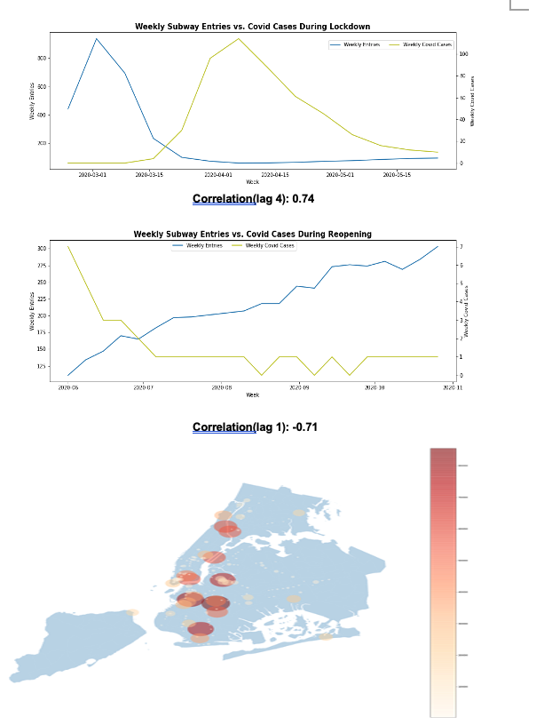

# MTA Data Analysis: Covid Control in Subway Stations
Wenting Deng

## Abstract
The goal of this project was to analyze the correlations between subway entries and Covid cases, in order to evaluate whether it would be helpful for the NYC Department of Health and Mental Hygiene to provide COVID health kits in subway stations, to help protect public health against COVID during the city's reopening period. If so, which stations should they target. I used [MTA-Turnstile-Data](http://web.mta.info/developers/turnstile.html) combined with [MTA-Location-Data](https://atisdata.s3.amazonaws.com/Station/Stations.csv), [MTA_Remote_Complex_Mapping](https://github.com/qri-io/data-stories-scripts/blob/master/nyc-turnstile-counts/lookup/remote_complex_lookup.csv) and [Covid-Daily-Cases](https://github.com/nychealth/coronavirus-data/tree/master/trends), aggregated data into weekly count metrics and ran the correlations in total and by boroughs. By analyzing the correlations, I was able to help identify the target stations for NYC DOHMH.

## Design
The project is for the NYC Department of Health and Mental Hygiene (NYC DOHMH). NYC DOHMH plans to provide some free COVID health kits in selected public areas in order to support the city's reopening. By doing this they also want to remind people to keep following pandemic rules during reopening phases. The correlations between foot traffic in subway stations (defined as subway entries) and the COVID cases could be an indicator to understand how would the COVID trend change as the outdoor foot traffic volume goes up. Thus to enable NYC DOHMH evaluate whether they should target subway stations. If so, which stations should be targeted.

## Data
The [MTA-Turnstile-Data](http://web.mta.info/developers/turnstile.html) data for this analysis contains data from February 2020 to October 2020. By leveraging the [MTA_Remote_Complex_Mapping](https://github.com/qri-io/data-stories-scripts/blob/master/nyc-turnstile-counts/lookup/remote_complex_lookup.csv) and [MTA-Location-Data](https://atisdata.s3.amazonaws.com/Station/Stations.csv), turnstiles are mapped into different station complex and latitude and longitude information.
The [Covid-Daily-Cases](https://github.com/nychealth/coronavirus-data/tree/master/trends) data for this analysis contains daily COVID cases by borough from March 2020 to October 2020.
All data are aggregated by weeks and boroughs for the correlation analysis.

## Algorithms
**Features**
1. Mapping subway turnstiles into station complex
2. Mapping station complex into borough
3. Appending station latitude and longitude from MTA-Location-Data
4. Aggregating daily subway entries into weekly basis
5. Aggregating daily COVID cases into weekly basis

**Models**
The correlation was calculate by different timings by boroughs:
* Lockdown Period: Feb 2020- May 2020
* Reopening Period: Jun 2020- Oct 2020

| Borough | Correlation- Lockdown Period | Correlation- Reopening Period |
| --- | --- | --- |
| Brooklyn | 0.78 | -0.52 |
| Bronx | 0.89 | -0.60 |
| Manhattan| 0.66 | -0.66 |
| Queens | 0.86 | -0.72|
| Staten Island | 0.88 | -0.43|

**Tools**
* SQLAlchemy, Pandas and Numpy for data manipulation and analysis
* Matplotlib and Seaborn for plotting

## Communication
In addition to the slides and visuals presented, it will be embedded on my analytic blog.

