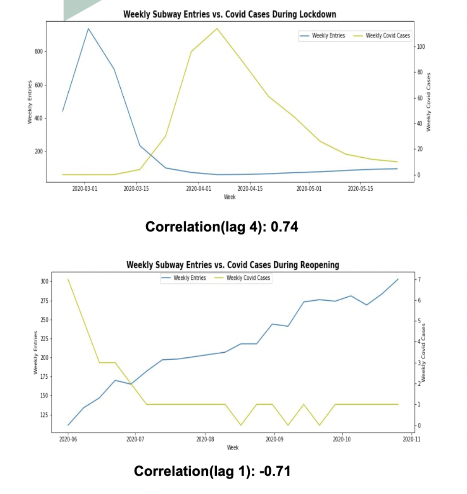

# Python Data EAD Exercise: MTA-Turnstile-Data

### Analysis Summary
This data EAD exercise is trying to combine NYC Covid data with MTA Turnstile data to:
* Visualize the trend of Covid-19 cases in NY and in each borough.
* Analyze the correlations between subway usages and the number of Covid cases in NY and in each borough.

*Lockdown Phase (before 6/1/2020)
The weekly entries and Covid cases show a strong POSITIVE correlation with a lag of 4 weeks.

*Reopening Phase
The weekly entries and Covid cases show a strong Negative correlation with a lag of 1 week.

The change of correlations indicates the way people engaging with Covid has changed. 

### Data Description
The following datasets were used for the analysis:
| Dataset | Link | Data Description |
| --- | --- | --- |
| data-by-day | https://github.com/nychealth/coronavirus-data/tree/master/trends | This dataset contains daily Covid trend data by boroughs |
| turnstile_xxxxxx|  http://web.mta.info/developers/turnstile.html | Weekly turnstile usage data |
| NY Subway Geospatial Data| https://data.cityofnewyork.us/Transportation/Subway-Stations/arq3-7z49 | Geo information of subway stations in NY |

The features that were included in the analysis:
 * Weekly Covid cases by boroughs of the latest 52 weeks
 * Weekly turnstile entries by boroughs of the latest 52 weeks

### Tools
* Python3
* SQLite
